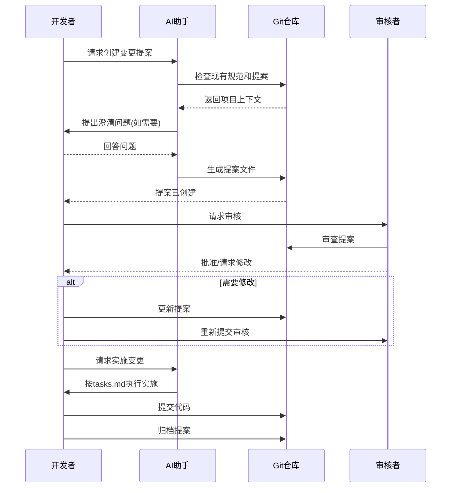
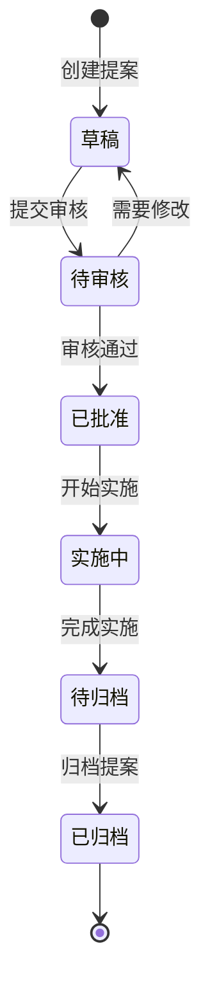
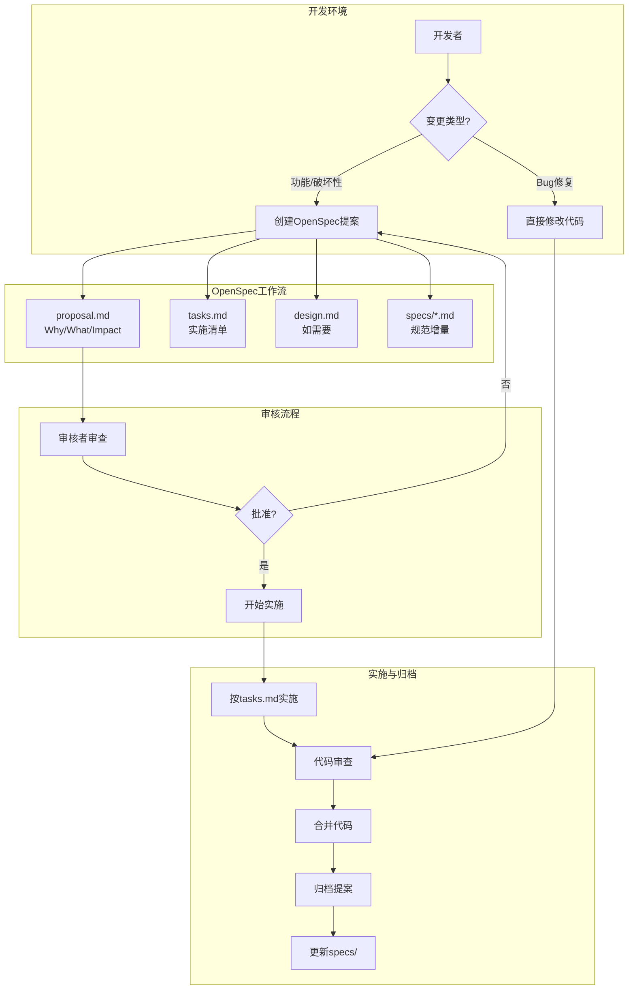
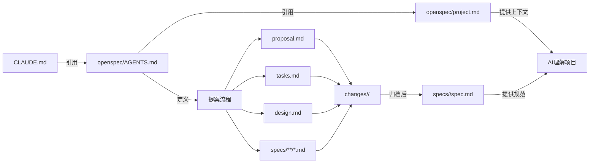
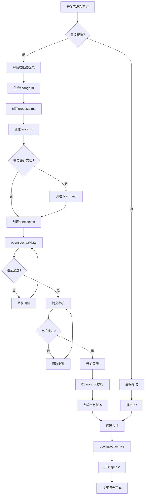

# Design: OpenSpec提案管理系统初始化

## Context

MC-MMD-rust是一个跨语言(Minecraft Mod开发)项目,结合了Rust物理引擎和Java渲染层。项目处于初始阶段,需要建立结构化的技术决策和变更管理机制。

### 现状
- 项目已有基础代码结构(rust_engine + Minecraft Mod)
- OpenSpec工具已初始化,但缺少项目特定的配置
- AGENTS.md和PROPOSAL_DESIGN_GUIDELINES.md已存在(通用模板)
- project.md需要填充项目特定内容

### 约束
- 必须保持OpenSpec标准格式以确保工具兼容性
- 需要支持跨语言开发的工作流
- 文档需要AI友好,便于Claude等助手理解
- 不应过度增加开发负担

## Goals / Non-Goals

### Goals
- 建立完整的项目上下文文档(project.md)
- 定制OpenSpec工作流以适应MC-MMD-rust项目特点
- 创建清晰的提案管理流程和模板
- 确保AI助手能准确理解项目规范
- 提供可追溯的技术决策历史

### Non-Goals
- 修改OpenSpec工具本身
- 强制所有代码变更都需要提案(保留快速修复通道)
- 替代现有的代码审查流程
- 创建过于复杂的层级结构

## Decisions

### 决策1: 项目上下文结构
**选择**: 使用OpenSpec标准的project.md结构,填充MC-MMD-rust特定内容

**理由**:
- 保持与工具兼容性
- 标准结构便于AI理解
- 涵盖所有必要的项目元数据

**关键内容**:
```markdown
## Purpose
在Minecraft 1.20.1中实现高性能的MMD模型渲染和物理模拟

## Tech Stack
- Rust 1.70+ (物理引擎)
- Java 17+ (Minecraft Mod)
- Gradle 8.x
- Rapier3D (物理)
- OpenGL/GLSL (渲染)

## Project Conventions
- 代码风格: Rust使用rustfmt, Java使用Google Style
- 架构模式: JNI边界分离,Rust负责物理/动画,Java负责渲染
- 测试策略: Rust单元测试 + Minecraft集成测试
```

### 决策2: 提案触发条件
**选择**: 定义明确的提案必要性判断标准

**理由**: 平衡规范化和灵活性

**需要提案的变更**:
- 新增功能或能力
- 破坏性变更(API, 数据格式, 架构)
- 跨边界的变更(Rust-Java接口)
- 性能优化(改变行为)
- 安全相关变更

**无需提案的变更**:
- Bug修复(恢复预期行为)
- 拼写错误、格式化、注释
- 依赖更新(非破坏性)
- 测试代码添加

### 决策3: 目录组织
**选择**: 按能力(capability)组织规范

**结构**:
```
openspec/
├── specs/
│   ├── pmx-model-loading/   # PMX模型加载
│   ├── vmd-animation/        # VMD动画播放
│   ├── physics-simulation/   # 物理模拟
│   ├── gpu-skinning/        # GPU蒙皮
│   └── jni-bridge/          # Rust-Java桥接
├── changes/
│   └── [change-id]/
└── archive/
```

**理由**:
- 能力独立且易于理解
- 便于按模块检索规范
- 符合OpenSpec最佳实践

### 决策4: AI代理指令定制
**选择**: 在AGENTS.md中添加项目特定的补充说明

**补充内容**:
- MMD/物理模拟领域的关键概念
- Rust-Java跨语言开发的注意事项
- 项目特定的文件组织约定
- 性能敏感区域的指导

**理由**: 通用指南已完善,只需添加项目特定内容

### 决策5: 设计文档策略
**选择**: 当且仅当满足以下任一条件时创建design.md

**条件**:
- 跨多个系统/模块的变更
- 引入新的架构模式
- 新的外部依赖或重大数据模型变更
- 涉及安全/性能/迁移的复杂性
- 需要可视化设计(UI/数据流/架构)

**理由**: 避免过度文档化,保持轻量级

## UI/UX Design

### OpenSpec工作流用户界面设计

本提案主要关注开发流程和文档结构,不涉及最终用户界面。以下是开发者交互流程:



### 提案状态流转图



## Technical Design

### OpenSpec架构集成



### 文档关系图



### 数据流: 提案创建到归档



### 代码变更清单

| 文件路径 | 变更类型 | 变更原因 | 影响范围 |
|---------|---------|---------|---------|
| `openspec/project.md` | 完整填充 | 添加MC-MMD-rust项目特定上下文 | 所有AI助手 |
| `openspec/AGENTS.md` | 补充说明 | 添加MMD/物理/Rust-Java特定指导 | AI工作流 |
| `openspec/changes/` | 目录创建 | 存放提案变更 | 提案管理 |
| `openspec/specs/` | 目录创建 | 存放已实现的规范 | 规范管理 |
| `openspec/changes/archive/` | 目录创建 | 存放历史提案 | 提案归档 |
| `CLAUDE.md` | 同步更新 | 确保OpenSpec指令一致 | 项目级AI指令 |

### 详细变更: project.md

| 章节 | 内容 | 来源 |
|------|------|------|
| Purpose | 在Minecraft 1.20.1中实现高性能的MMD模型渲染和物理模拟 | README.md |
| Tech Stack | Rust 1.70+, Java 17+, Gradle 8.x, Rapier3D, OpenGL | README.md, build.gradle |
| Code Style | Rust: rustfmt, 2018 edition; Java: Google Style, 4 spaces | 项目约定 |
| Architecture | JNI边界分离: Rust负责物理/动画, Java负责渲染/游戏集成 | README.md |
| Testing | Rust: cargo test; Java: JUnit + Minecraft测试模组 | 项目约定 |
| Git Workflow | main分支保护, feature分支, PR审查, 提案关联 | 项目约定 |
| Domain Context | PMX/VMD格式, 骨骼动画, 物理模拟, IK求解, GPU蒙皮 | README.md |
| Constraints | Minecraft 1.20.1限制, 60FPS性能目标, 内存限制 | 项目要求 |
| External Dependencies | Rapier, glam, mmd-rs, Minecraft Fabric/Forge API | README.md, Cargo.toml |

### 详细变更: AGENTS.md补充

| 补充章节 | 内容 | 目标 |
|---------|------|------|
| MMD概念 | PMX/VMD格式说明, 骨骼/IK/物理概念 | 理解领域知识 |
| 跨语言开发 | JNI边界处理, FFI安全性, 数据传输优化 | 正确处理Rust-Java交互 |
| 性能考虑 | 物理模拟性能, GPU计算优化, 内存管理 | 保持60FPS |
| 文件组织 | rust_engine/, fabric/, forge/, common/ 目录说明 | 理解代码结构 |

## Risks / Trade-offs

### 风险1: 学习曲线
**描述**: 团队需要学习OpenSpec工作流和文档格式

**缓解措施**:
- AGENTS.md提供详细指南
- 创建示例提案
- 从简单提案开始
- 保留直接修复通道

### 风险2: 过度文档化
**描述**: 文档编写可能占用大量开发时间

**缓解措施**:
- 明确什么需要提案,什么不需要
- design.md仅必要时创建
- 使用模板加速文档编写
- AI辅助文档生成

### 风险3: 工具兼容性
**描述**: OpenSpec CLI工具可能的版本兼容问题

**缓解措施**:
- 记录openspec版本(.version文件)
- 使用标准格式避免自定义扩展
- 定期测试工具命令

### 权衡: 标准化 vs 灵活性
**选择**: 采用OpenSpec标准格式,但在内容上项目定制化

**理由**:
- 标准格式确保工具兼容性
- 内容定制适应项目需求
- 平衡规范化和实用性

## Migration Plan

### 阶段1: 初始化(当前提案)
1. 完成project.md文档化
2. 创建目录结构
3. 定制AI代理指令
4. 验证工具可用性

### 阶段2: 试点应用
1. 选择1-2个中等复杂度功能创建提案
2. 验证工作流的实际效果
3. 收集团队反馈
4. 调整流程和模板

### 阶段3: 全面推广
1. 将OpenSpec纳入标准开发流程
2. 要求所有重大变更通过提案
3. 建立提案审核机制
4. 定期归档完成的提案

### 回滚计划
如果OpenSpec流程不适应项目:
- 保留所有生成的文档作为项目历史参考
- 恢复到直接代码审查流程
- 保留project.md作为项目文档(仍有价值)

## Open Questions

1. **提案审核机制**: 是否需要设立专门的提案审核角色,还是由现有的代码审查者兼任?
   - **建议**: 初期由现有审查者兼任,根据负载考虑是否设立专门角色

2. **提案粒度**: 对于包含多个独立功能的大型PR,应该创建一个提案还是多个?
   - **建议**: 优先创建多个独立提案,便于审核和实施

3. **紧急变更**: 如何处理需要紧急修复但不等待完整提案流程的情况?
   - **建议**: 允许事后补提案,在tasks.md中记录实施和文档化的顺序

4. **历史代码**: 是否需要为现有功能创建追溯性规范文档?
   - **建议**: 不强制要求,在后续修改相关代码时逐步补全

## References

- [OpenSpec AGENTS.md](/openspec/AGENTS.md) - AI代理使用指南
- [PROPOSAL_DESIGN_GUIDELINES.md](/openspec/PROPOSAL_DESIGN_GUIDELINES.md) - 提案设计指南
- [项目README.md](/README.md) - 项目概述
- [ACKNOWLEDGMENTS.md](/ACKNOWLEDGMENTS.md) - 依赖和致谢
